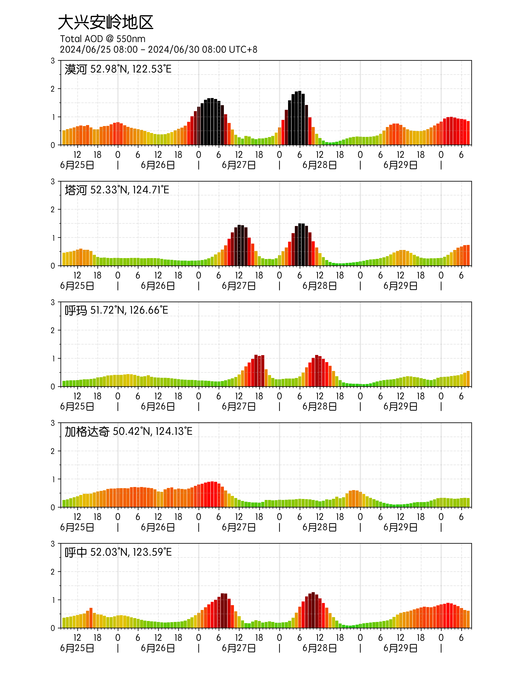

# CAMS Tools

读取CAMS官网数据库的数据文件(netCDF格式)，提取指定坐标点的550nm气溶胶光学深度(Total aerosol optical depth at 550 nm)预报值，然后生成直观的柱状图表，用于社交媒体及公众号。

AOD(Aerosol Optical Depth)@550nm，是550nm绿光波段上，气溶胶光学深度的测量值，描述了诸如沙尘、生物质燃烧、硫酸盐生成物等气溶胶的浓度，例如俄罗斯西伯利亚森林火灾导致的烟雾、蒙古戈壁春季的沙尘暴。指数越高，空气污染程度越严重，大气能见度越低。

一些偏远地区的城镇和自驾游线路（例如新疆、青藏高原、大兴安岭地区等），没有国家空气质量监测网络覆盖，可以使用CAMS预报模型生成预报图。


* netCDF下载地址(须注册账号，也可以获取APIKey直接访问数据)：https://ads.atmosphere.copernicus.eu/datasets/cams-global-atmospheric-composition-forecasts?tab=overview 
* UTC 00:00和12:00各生成一次未来120小时的预报数据，大约8-10小时后可下载。
* 水平网格分辨率： 0.4°x0.4°

<br/>


# 哥白尼大气监测服务

哥白尼大气监测服务(CAMS)是由欧洲中期天气预报中心(ECMWF)实施的一项服务，于2014年11月11日启动，提供有关大气成分的连续数据和信息。作为哥白尼计划的一部分，CAMS描述大气实时状况，预测未来几天的情况，并持续分析近年来的历史数据记录。CAMS 跟踪全球空气污染、太阳能、温室气体和气候变化特征。

<br/>
<br/>
<br/>

# CAMS Tools
  
Read the CAMS (Copernicus Atmosphere Monitoring Service) database (netCDF format), extract the 550 nm Aerosol Optical Depth (AOD) forecast values for specified coordinates, and generate intuitive bar charts for social media and WeChat public accounts.

AOD (Aerosol Optical Depth) @ 550 nm refers to the measurement of aerosol optical depth at the green light wavelength of 550 nm. It reflects the concentration of aerosols such as dust, biomass burning emissions, and sulfate particles — for example, smoke from wildfires in Siberia, Russia, or springtime dust storms from the Gobi Desert in Mongolia. The higher the index, the more severe the air pollution and the lower the atmospheric visibility.

For some remote towns and self-driving routes (e.g., Xinjiang, the Qinghai–Tibet Plateau, the Greater Khingan Mountains), where the national air quality monitoring network does not reach, CAMS forecast models can be used to generate predictive charts.

* netCDF download link: https://ads.atmosphere.copernicus.eu/datasets/cams-global-atmospheric-composition-forecasts?tab=overview

* Forecast data are generated twice daily at 00:00 UTC and 12:00 UTC for the next 120 hours, and become available approximately 8–10 hours later.

* Horizontal grid resolution: 0.4° × 0.4°.

<br/>

# Copernicus Atmosphere Monitoring Service(CAMS)

The Copernicus Atmosphere Monitoring Service (CAMS) is a service implemented by the European Centre for Medium-Range Weather Forecasts (ECMWF). Launched on November 11, 2014, it provides continuous data and information on atmospheric composition.
As part of the Copernicus Programme, CAMS describes the current state of the atmosphere, forecasts conditions for the coming days, and continuously analyzes historical data records from recent years. CAMS tracks global air pollution, solar energy, greenhouse gases, and key climate change indicators.

<br/>

# Examples
2024年俄罗斯西伯利亚森林野火季，导致中国东北地区持续性的重度雾霾天气。下图为6月25日至6月30日的预报图。

The 2024 wildfire season in Siberia, Russia, caused persistent heavy smog in Northeast China.
The following image shows the forecast from June 25 to June 30.



# Setup

```bash
# set up venv
python3 -m venv /path/to/python_lib 
source /path/to/python_lib/bin/activate

# install lib
pip install cdsapi
pip install xarray
pip install matplotlib

pip install netcdf4
pip install h5netcdf

# run
python3 cams.py

# deactivate
deactivate

```

